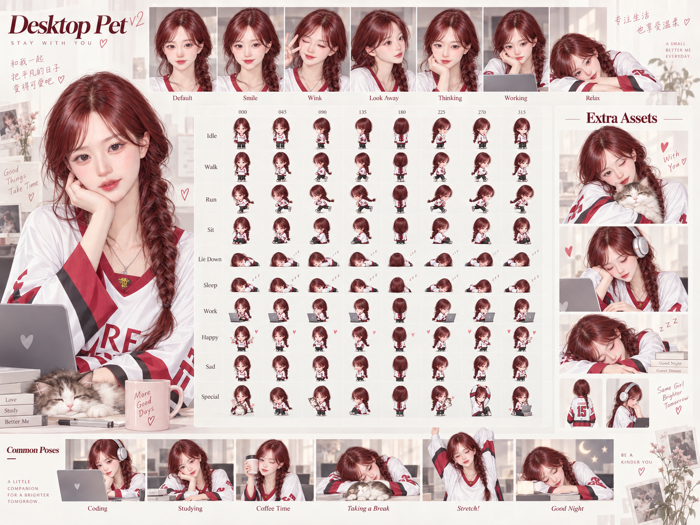

# Desktop Pet Board — 桌宠角色设定板

A single-image "Desktop Pet character design board / asset concept board"
generated from real portrait references, in a cream + wine-red Korean
semi-realistic illustration style.

## Contents

| Path | Description |
| --- | --- |
| `output/desktop-pet-board.png` | Final concept board poster (1448 × 1086) |
| `references/layout-reference.jpg` | Board layout / style reference |
| `references/character-front.jpg` | Character identity reference (front) |
| `references/character-side.jpg` | Character identity reference (side braid) |
| `prompts/board-generation.md` | The generation prompt used |

## Board layout

- **Main visual (left):** seated half-body portrait — chin on hand, desk,
  laptop, sleeping cat, mug
- **Expression strip (top):** Default / Smile / Wink / Look Away / Thinking /
  Working / Relax
- **Sprite preview grid (center):** Idle, Walk, Run, Sit, Lie Down, Sleep,
  Work, Happy, Sad, Special × directions 000–315
- **Extra Assets (right):** cat hug, headphones + computer, sleeping on
  books, plus two mini sprites
- **Common Poses (bottom):** Coding / Studying / Coffee Time /
  Taking a Break / Stretch! / Good Night

## Character

Wine-red/burgundy-brown side fishtail braid, fair skin, gentle cool-toned
eyes; oversized white campus jersey with red V-neck, red/black striped
cuffs, "KOREA UNIVERSITY" lettering, tiger emblem, number 15 on the back.

## Generation

Generated via the `hatch-pet` / `imagegen` workflow (Codex built-in
`image_gen`) using the three reference images in `references/`.
Skill: `~/.codex/skills/hatch-pet/SKILL.md`

## Campus Muse Codex pet

The installable desktop pet and the separate ChatGPT web upload image are in [`pets/campus-muse/`](pets/campus-muse/). Download the ready-to-use bundle from [`output/campus-muse-codex-pet.zip`](output/campus-muse-codex-pet.zip); it contains the pet metadata, desktop sprite sheet, web upload image, instructions, and license. The web image is a transparent 1536 × 1872 PNG. See [`pets/campus-muse/README.md`](pets/campus-muse/README.md) for installation and upload steps.

The new pet release is licensed separately under CC BY 4.0. This does not relicense the existing board or references, or grant rights to third-party names, logos, or trademarks shown in the art.
